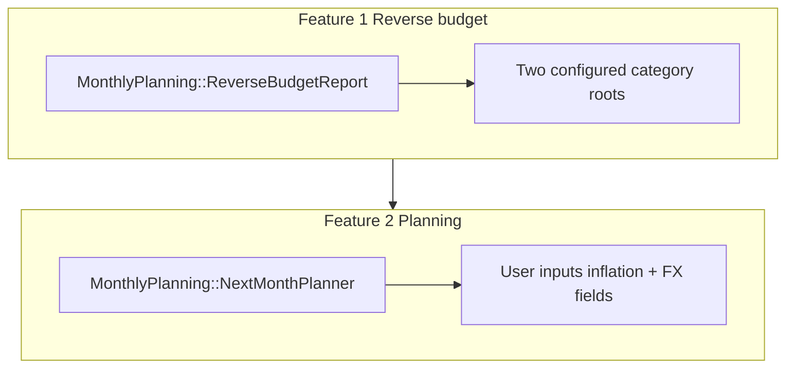

# Monthly planning (Excel replacement)

## Code and naming (English only)

- **Modules, classes, methods, variables, filenames, routes, URL params, ENV keys, and database table/column names** must use **English** (e.g. `MonthlyPlanning::ReverseBudgetReport`, `monthly_planning_snapshots`, `/monthly-planning`, `MONTHLY_PLANNING_ENABLED`).
- **User-visible strings** in the app should follow existing Maybe convention: **English** in UI copy (per project guidelines).
- **Exception — user data, not code:** Monthly planning uses **two parent expense categories** whose **names and hierarchy** are entirely up to you (e.g. _Cash_ / _Credit card_, or _Efectivo_ / _Tarjeta_—only examples). Names live in the DB as normal `Category` records. Code stores **two category UUIDs** (settings) and shows **whatever name** each category has—no hardcoded labels in Ruby.

---

## Test-driven development (TDD)

- **Mandatory** for this feature: **write a failing test first**, then implement the smallest change that passes, then refactor. Repeat for every behavior.
- **Order of work (typical):** (1) **PORO / domain** tests for `ReverseBudgetReport`, `NextMonthPlanner` (formulas, day counts, tiered FX, inflation)—pure Ruby, fast. (2) **Model** tests for settings + snapshot persistence (`MonthlyPlanningSnapshot`), validations, `family` scoping. (3) **Controller / request** tests for auth, happy paths, and snapshot save/history. (4) **System tests** only if a critical flow needs them (project convention: use sparingly).
- **Stack:** Minitest + fixtures (not FactoryBot), matching project testing docs (e.g. [`CLAUDE.md`](../../CLAUDE.md)).
- **UI (testing):** Where logic is thin, tests still cover **assigns**, redirects, and snapshot CRUD; avoid testing markup details unless needed. **Usability and copy** are covered by the **UX / design system** section below, not by asserting HTML in tests.

---

## UX, design system, and content (mandatory)

- **User-friendly by default:** Flows should be **obvious without prior context**: short page intro, **clear section headings**, scannable tables/lists, and **one primary action** per screen where possible (e.g. save snapshot). Avoid domain jargon unless paired with a **plain-language** label or helper line.
- **Design system:** Follow [`app/assets/tailwind/maybe-design-system.css`](../../app/assets/tailwind/maybe-design-system.css) — use **functional tokens** (`text-primary`, `bg-container`, `border-primary`, etc.), not ad-hoc colors. Do **not** add new global styles to the design system files without explicit approval (per project UI rules).
- **Reuse Maybe patterns:** Mirror **month navigation** and layout habits from **Budgets** where it fits ([`Budget`](../../app/models/budget.rb) param style, familiar chrome). Prefer **existing ViewComponents**, partials, and Stimulus patterns used elsewhere; use the app’s **`icon` helper** ([`application_helper.rb`](../../app/helpers/application_helper.rb)), not raw Lucide calls. Semantic HTML (`<section>`, headings, tables with clear headers).
- **Instructions:** **First-time / empty states** when roots are not configured (what to do in Categories, link or path to settings). **Helper text** on inputs: inflation (percent vs multiplier), FX fields, run-rate root selector. **Progressive disclosure:** default **simple** FX path visible; **tiered split** behind an expand/advanced control with a sentence explaining when to use it.
- **Explanations:** Every formula step stays **human-readable**: show **inputs**, **day counts** for reference and next month, **intermediate values**, and **final results**. Use short **tooltips** or `
` where deeper detail would clutter the main view.
- **Accessibility:** Sufficient contrast via tokens, logical heading order, labels tied to inputs, error messages next to fields.
- **Reference:** [`.cursor/rules/ui-ux-design-guidelines.mdc`](../../.cursor/rules/ui-ux-design-guidelines.mdc) for HTML/CSS/Stimulus expectations.

---

## High-level overview (no codebase knowledge required)

**Maybe** is a self-hosted personal finance web app. Users record **transactions** in **accounts** and assign **categories**. The app already has a forward-looking **Budget** feature (allocate amounts per category per month).

This work adds a **separate** area of the product—**not** a replacement for Budgets—with two ideas:

1. **Reverse budget**  
   Instead of deciding amounts in advance, you look at **what you actually spent last month**, broken down by category. You pick **two parent expense categories** in **Maybe’s existing Categories flow** (any names you want) and nest your other expense categories under them. This feature does **not** add a parallel category system; it **reads** the tree and aggregates. The **monthly planning** screen shows totals for the **previous month** for **each root** and for **each child category** under them, so you can plan the **next** month with real numbers.

2. **Next-month planning (FX / inflation)**  
   A second step uses **your** inputs (inflation %, one or more **FX rates** or conversion assumptions you type in) and runs **transparent calculations** you can audit on screen—e.g. a **run-rate** projection on the configured **run-rate root**, plus **prior-month spending** on the **other root** (see Feature 2), then converting to your target currency (e.g. USD). **No** automated fetch of rates from external sites; all FX and inflation values are **manual entry**.

**Why this lives in the app:** transactions are already in Maybe; the spreadsheet was the fragile link. The database becomes the single source of truth; this feature only **reads** and **computes**—no duplicate ledger.

---

## Terminology

| Term                    | Meaning                                                                                                                                                                                                                              |
| ----------------------- | ------------------------------------------------------------------------------------------------------------------------------------------------------------------------------------------------------------------------------------ |
| **Root / bucket**       | One of the **two** top-level expense parents you configure for monthly planning. **Names are arbitrary** (examples only: _Cash_, _Credit card_, _Efectivo_, _Tarjeta_). The UI always shows the **actual category name** from Maybe. |
| **Role (for formulas)** | A **setting** picks which root is the **run-rate root** (step 1). The **other root** always contributes **prior-month spending only**—no projection for that branch.                                                                 |

---

## Relationship to existing Maybe features

- **Separate from Budgets** ([`Budget`](app/models/budget.rb), [`BudgetsController`](app/controllers/budgets_controller.rb)): different mental model (look back → plan forward vs allocate forward). New routes and nav entry; do not overload the Budget screens.
- **Reuse**:
  - **Categories**: **No new category editor.** Use the app’s current **Categories** screens to create **two parent** categories (any names) and nest children under them—same `parent_id` hierarchy already modeled in [`Category`](app/models/category.rb) (`Category::Group`, subcategories).
  - **Reporting math**: [`IncomeStatement`](app/models/income_statement.rb) already exposes expense totals by category for a period; the monthly planning report maps those totals onto **each configured root** via the existing tree.
  - **UI**: same layout, components, and design tokens as the rest of the app—see **UX, design system, and content** above. [`application.html.erb`](../../app/views/layouts/application.html.erb), [`maybe-design-system.css`](../../app/assets/tailwind/maybe-design-system.css); category CRUD stays where it is today.
- **Transaction rules**: keep using the same visibility rules as income statement (e.g. exclusions for `funds_movement`, `cc_payment`, `one_time` where applicable—align with [`IncomeStatement::Totals`](app/models/income_statement/totals.rb) so numbers match the rest of the app).

---

## User convention (category tree)

Maintain **two top-level expense parents** (names are **your choice**—only examples: _Cash_ / _Card_, _Efectivo_ / _Tarjeta_) using **Maybe’s existing category flow** (create parent categories, assign child categories under them in the normal UI). No separate monthly-planning category screen. All other expense categories used for this workflow should be **children** (or deeper descendants) of one of those roots. The feature **classifies** spending by resolving each transaction’s category to **one of the two configured roots** and aggregate:

- Per **child category** (spend last month).
- Per **root** (total per bucket last month).

If a category is not under one of these two roots, the UI should show it clearly (e.g. “outside monthly planning roots”) so you can fix the tree.

---

## Feature 1 — Reverse budget

**Goal:** For a selected **reference month** (typically **previous calendar month**), show:

- Total expenses under **root 1** (label = that category’s **name** in Maybe; sum of children + rollups as already defined by category tree).
- Total expenses under **root 2** (same).
- A **breakdown** by child category under each root (and optionally sub-subcategories if nested deeper—same rollup rules as existing category totals).

**Implementation sketch:**

- **Data entry**: Users create/edit parents and children only through **existing** Categories CRUD in Maybe—this feature adds **read-only aggregation** on top.
- Input: `family`, `period` (month range).
- Resolve category → parent bucket: walk `parent_id` until hitting one of the two configured roots (implementation: **two stored category UUIDs** on settings—prefer this over name matching so **any display name** works and renames don’t break code).
- Reuse expense aggregation patterns from `IncomeStatement` / `Totals` rather than inventing new SQL in controllers; add a thin PORO e.g. `MonthlyPlanning::ReverseBudgetReport` that maps `CategoryTotal`-style rows into parent buckets.

---

## Feature 2 — Next-month planning (FX, inflation, formulas + inputs)

All **intermediate steps** must be **visible** on the page so you can confirm arithmetic.

**Inputs (user-editable):**

- **Inflation rate** (e.g. monthly IPC or your own factor)—applied where the formula below uses it.
- **FX / conversion inputs** — **All values are entered manually.** **Default UX:** a **simple** conversion (e.g. one effective rate domestic → target currency, or minimal fields). **Also ship:** an **optional tiered split** (e.g. first _N_ units at rate A, remainder at rate B)—implemented and visible when enabled, but **not** the default mode (user opts in / expands “advanced” or similar).

**Formulas (as specified):**

A **setting** stores which category is the **run-rate root** (the other root is implicit: **prior-month only**). Not hardcoded to category names.

1. **Run-rate projection (run-rate root only), using days (not weeks):**  
   `(Spent under that root / days in reference month) × days in next month × (1 + inflation)`  
   **Days** = **calendar days** in each month (28–31). Use the same **month boundaries** as the rest of the report (reference month = period you’re planning from; “next month” = the month you’re planning for). **Exact interpretation of “inflation rate”** as multiplier vs percent—implement as explicit labeled formula in UI, e.g. “inflation 5% → multiply by 1.05”.

2. **Combined need:**  
   `(Projected amount from step 1) + (prior-month total spend under the non-run-rate root)` — the **non-run-rate root** always uses **prior-month spending** only (no optional projection for that root).

3. **Conversion to target currency (e.g. USD):**  
   Use **your entered** rates for domestic currency → target currency. **Default:** straightforward conversion from the simple FX inputs. **Tiered split** (first _N_ units at rate A, remainder at rate B) is **implemented** in the same step as an **opt-in** path with the extra input fields and a clear subtotal breakdown—**not** the default layout or assumption.

**Persistence (required):** Save a **snapshot per planning run** (or per reference month—pick one consistent rule in implementation) so you can **review history** without the old spreadsheet. Store at minimum: **reference month**, **inputs** (inflation, FX fields, tiered-split flag and values), **key computed outputs** (combined need, conversion results, etc.), **`family_id`**, timestamps. Use a dedicated table (e.g. `monthly_planning_snapshots`) with `jsonb` for flexible input/output blobs if needed. UI: **save** action plus a way to **list or open past snapshots** (month picker or table).

---

## Architecture (updated)

---

## Routes and UI

- New resource under a dedicated English path, e.g. `/monthly-planning` (controller `monthly_planning`, views under `app/views/monthly_planning/`), **not** nested under `budgets`.
- **Month navigation**: reuse the same param style as budgets (`feb-2026`) for consistency ([`Budget`](../../app/models/budget.rb) `PARAM_DATE_FORMAT`).
- **Pages**: (1) Reverse budget for month M; (2) Planning section on same flow or tab—**reference month vs next month** labeled plainly; apply **UX, design system, and content** for copy and layout.
- **Nav**: add item in [`application.html.erb`](../../app/views/layouts/application.html.erb) with an English label (e.g. “Monthly planning”) (single-tenant: optional `ENV` kill switch such as `MONTHLY_PLANNING_ENABLED`).

---

## What stays out of scope (initial ship)

- **Automated FX / rate fetch** from external websites or APIs (manual inputs only).
- AFIP / factura.
- Bank CSV import automation.
- Migrating old Excel rows into the DB (Excel remains an archive).

---

## Implementation notes (codebase)

- **Stack**: No new HTTP client work required for FX (no rate fetch).
- **TDD**: See **Test-driven development (TDD)** above—tests drive implementation, not the reverse. Cover PORO math, inflation handling, **months with different day counts** (28/29/30/31), tiered FX branches, and snapshot round-trips with Minitest.

---

## Risks

- **Category tree drift**: Spending outside the two configured roots must be obvious in the UI.
- **Month length / timezone**: **Days** are **calendar days** in the relevant month (simpler and more precise than counting weeks). Document whether boundaries use the **family timezone** or plain **date** math so February and DST edge cases are consistent; surface **day counts** in the UI next to the formula so the user can verify.

---

## Files to add / touch (indicative)

| Area               | Action                                                                                                                                                                 |
| ------------------ | ---------------------------------------------------------------------------------------------------------------------------------------------------------------------- |
| Domain             | `MonthlyPlanning::ReverseBudgetReport`, `MonthlyPlanning::NextMonthPlanner` under `app/models/monthly_planning/`                                                       |
| Settings           | Migration + `FamilyMonthlyPlanningSetting` (or equivalent) for both root category IDs and **`run_rate_root_category_id`**                                              |
| Snapshots          | Migration + `MonthlyPlanningSnapshot` model (`monthly_planning_snapshots`), `belongs_to :family`; **required** for history                                             |
| Controller + views | `MonthlyPlanningController`, `app/views/monthly_planning/*.erb` using existing components/partials; **UX section** applies (tokens, helper text, formula explanations) |
| Routes             | [`config/routes.rb`](config/routes.rb) — `resources :monthly_planning` or singular resource as fits                                                                    |
| Nav                | [`application.html.erb`](app/views/layouts/application.html.erb)                                                                                                       |
| Tests              | `test/models/monthly_planning/`, `test/controllers/` or `test/integration/` as needed—**written before** corresponding production code per TDD                         |
